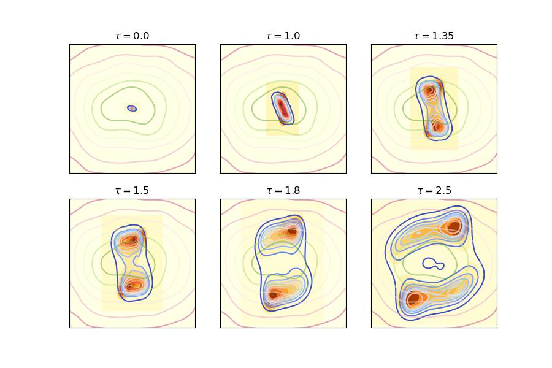

# AE_diffusion
Code for the paper : architectural bias in transport-based generative models - precise asymptotics

- Simulations.ipynb provides the code necessary to train the generative model, and produce the samples.
- Theory.ipynb implements the theoretical characterization of Corollary 2.3 on low-dimensional projections of the generated density, for the example of a trimodal Gaussian mixture target.
