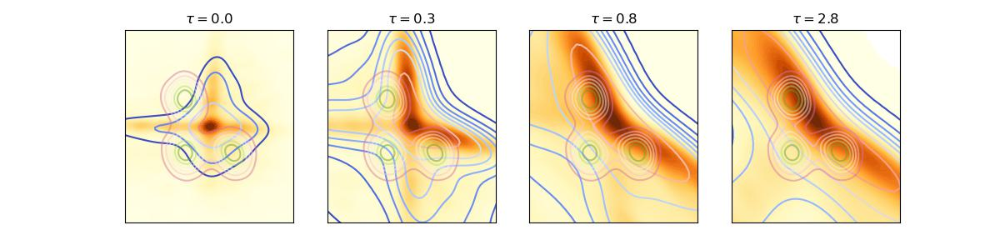

# AE_diffusion
Code for the paper : <i>architectural bias in transport-based generative models - precise asymptotics</i> (<a href="https://arxiv.org/abs/2501.03937">arXiv</a>)

- <tt>Simulations.ipynb</tt> provides the code necessary to train the generative model, and produce the samples.
- <tt>Theory.ipynb</tt> implements the theoretical characterization of Corollary 2.3 on low-dimensional projections of the generated density, for the example of a trimodal Gaussian mixture target (Fig. 1).

<u> Versions:</u> These notebooks employ <tt>Python 3.12 </tt>, and <tt>Pytorch 2.5</tt>.
